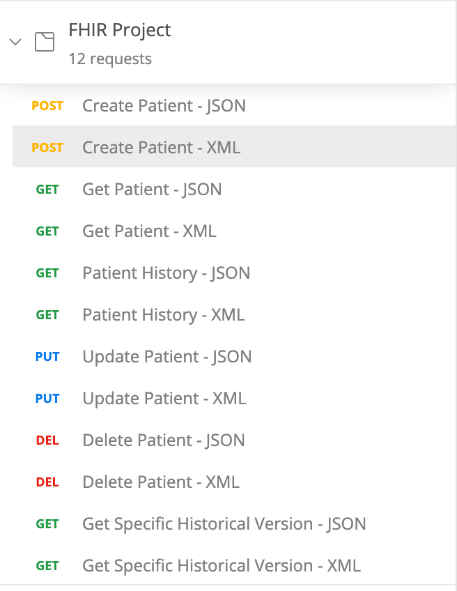
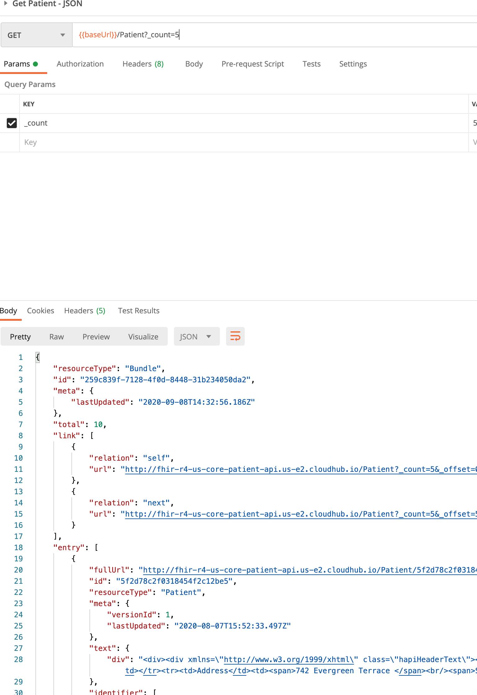

# FHIR Postman Collection

This postman collection provides ready-to-use tests for demonstrating the functionality of the FHIR server built with MuleSoft.

The included environment files allow you to setup a CloudHub and Local environment for easy switching of environment variables.

